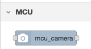
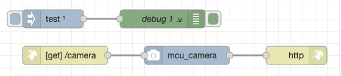

# node-red-contrib-mcu-camera

Camera node with Node-RED MCU

This node is tested on XIAO ESP32S3 Sense and M5AtomS3R M12 devices.

## Overview

There is mcu_camera node.  



## How to use

1. Build the environment for the Node-RED MCU plugin  

2. Install this node  

Add node-red-contrib-mcu-camera from the "Manage palette" in Node-RED

 or execute the following command.  

```
npm install <folder_path>  
```

3. Try to build with the Node-RED MCU plugin.

## Node-RED flow

Node-RED flow  



## Sample test

Sample test on XIAO ESP32S3 Sense and M5AtomS3R M12 devices.

